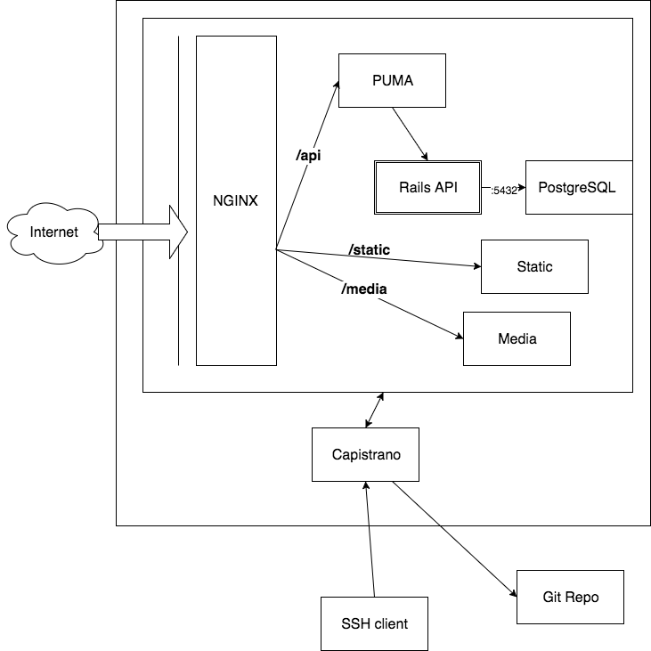

# Проект "Офисная библиотека"
## ВАЖНО
Возможный стек технологий:
 1. Rails API 
 2. React + React Router + Redux (optional) на Node
 3. nginx
 4. PostgreSQL
 5. Хостим бек-сервер на ?
## Описание проекта
 Краткое описание проекта:
 Должно быть разработано веб-приложение, позволяющее вести учет использования общей офисной библиотеки. Сотрудники должны иметь возможность брать книги из библиотеки и добавлять в библиотеку свои книги. Минимально необходимый функционал:
* Оставление рецензий на книги
* Запрос рецензии у уже прочитавших
* Оставить запрос на книги, которые уже кто-то читает, о чем уведомлять читающего
* Внутренние рейтинги книг

 Серверная часть приложения должна быть реализована на Ruby on Rails.

## Заказчик
ФГБУ «ЦЭКИ» Контакное лицо: Бендюкова Оксана hr@ceki.ru

## Архитектура

## Полезные ссылки
 1. [A Top Shelf Web Stack—Rails 5 API + ActiveAdmin + Create React App](https://medium.com/superhighfives/a-top-shelf-web-stack-rails-5-api-activeadmin-create-react-app-de5481b7ec0b) 
 2. [Build a RESTful JSON API With Rails 5 - Part One](https://scotch.io/tutorials/build-a-restful-json-api-with-rails-5-part-one)

